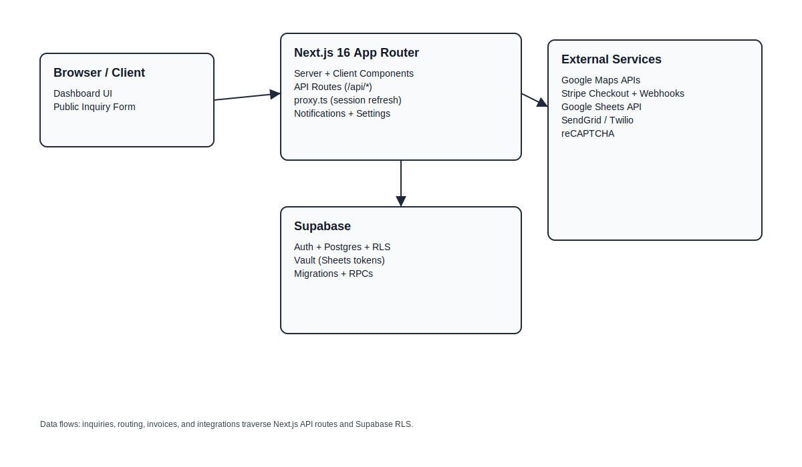

# Architecture

## Overview

LawnCare CRM is a Next.js 16 App Router application backed by Supabase. The UI uses server components and client components, while API routes handle public inquiry intake, Stripe webhooks, and Google Sheets OAuth.

## Architecture Diagram

## System Diagram (Text)

[Browser]
  |  /login, /inquiry, /dashboard
  v
[Next.js 16 App Router]
  |-- Server components + client components
  |-- API routes (/api/*)
  |-- proxy.ts (session refresh)
  |
  |--> Supabase Auth + Postgres + RLS
  |--> Supabase Vault (Google Sheets tokens)
  |--> Google Maps APIs (browser + server)
  |--> Stripe (checkout + webhooks)
  |--> Google Sheets API (OAuth)
  |--> SendGrid/Twilio (optional notifications)
  |--> reCAPTCHA (optional)

## Key Data Flows

### Public Inquiry
1. Visitor submits `/inquiry` form.
2. `/api/inquiries` validates input, runs spam checks, and enforces rate limits.
3. Inquiry is inserted into `public.inquiries` (RLS allows anon inserts).
4. Optional notifications send via SendGrid/Twilio if configured.

### Stripe Payments
1. Invoices create Stripe Checkout sessions from the dashboard.
2. Stripe sends `checkout.session.completed` or `payment_intent.succeeded` to `/api/stripe/webhook`.
3. Webhook inserts payment records and updates invoice totals and status.

### Google Sheets Import/Export
1. Admin connects Google Sheets from Customers -> Import/Export.
2. OAuth completes via `/api/google-sheets/callback`.
3. Tokens are stored in Supabase Vault and used to read sheets.

## Security Boundaries

- Supabase Row Level Security enforces access by role (anon, staff, admin, service_role).
- The service role key is server-only and required for rate limiting, webhooks, and scripts.
- OAuth tokens for Google Sheets are stored in Supabase Vault, not plaintext tables.
- reCAPTCHA and honeypot fields help reduce spam on the public inquiry form.

## Related Docs

- `API_REFERENCE.md`
- `DEPLOYMENT.md`
- `SECURITY.md`